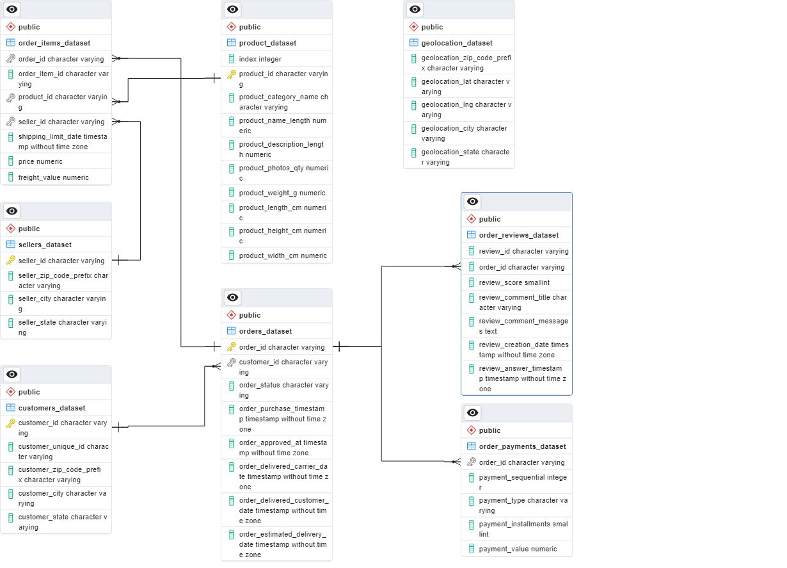

# Analyzing-eCommerce-Business-Performance-with-SQL

**Tool :** PostgreSQL  
**Programming Language :** SQL  
**Visualization Tool :** Tableau  

## Introduction
Pada project ini, sebagai anggota tim Data Analytics di sebuah perusahaan eCommerce akan melakukan analisis terhadap aspek yang berkaitan dengan performa bisnis perusahaan. Mengukur performa bisnis sangatlah penting untuk melacak, memantau, dan menilai keberhasilan atau kegagalan dari suatu proses bisnis. Mengukur performa bisnis dapat dilakukan dengan memperhitungkan beberapa metrik bisnis. Oleh karena itu, metrik bisnis yang akan dianalisa pada project ini yaitu pertumbuhan pelanggan, kualitas produk, dan tipe pembayaran berdasarkan data history selama 3 tahun.

## Objective
Mengumpulkan insight dari analisis dan visualisasi terkait :
1. Annual Customer Activity Growth
2. Annual Product Category Quality
3. Annual Payment Type Usage

## Data Preparation
1. Membuat database menggunakan pgAdmin.
2. Membuat 9 tabel menggunakan statement `CREATE TABLE`.
3. Melakukan import data csv ke dalam database.
4. Menentukan Primary Key dan Foreign Key menggunakan statement `ALTER TABLE`.
5. Membuat dan export ERD (Entity Relationship Diagram).

**Hasil ERD:**

   

## Data Analysis
### 1. Annual Customer Activity Growth
   

