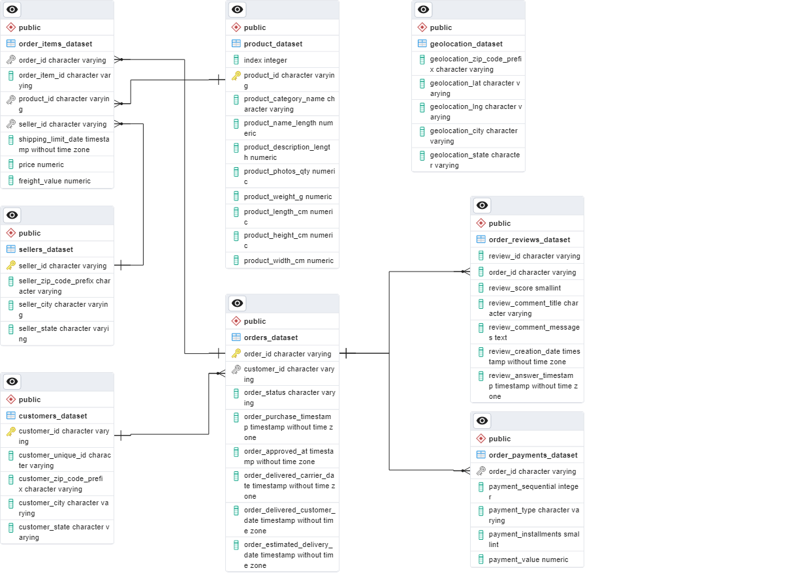

# Analyzing-eCommerce-Business-Performance-with-SQL

**Tool :** PostgreSQL  
**Programming Language :** SQL  
**Visualization Tool :** Excel  

## Introduction
Pada project ini, sebagai anggota tim Data Analytics di sebuah perusahaan eCommerce akan melakukan analisis terhadap aspek yang berkaitan dengan performa bisnis perusahaan. Mengukur performa bisnis sangatlah penting untuk melacak, memantau, dan menilai keberhasilan atau kegagalan dari suatu proses bisnis. Mengukur performa bisnis dapat dilakukan dengan memperhitungkan beberapa metrik bisnis. Oleh karena itu, metrik bisnis yang akan dianalisa pada project ini yaitu pertumbuhan customer, kualitas produk, dan tipe pembayaran berdasarkan data history selama 3 tahun.

## Objective
Mengumpulkan insight dari analisis dan visualisasi terkait :
1. Annual Customer Activity Growth
2. Annual Product Category Quality
3. Annual Payment Type Usage

## Data Preparation
1. Membuat database menggunakan pgAdmin.
2. Membuat 9 tabel menggunakan statement `CREATE TABLE`.
3. Melakukan import data csv ke dalam database.
4. Menentukan Primary Key dan Foreign Key menggunakan statement `ALTER TABLE`.
5. Membuat dan export ERD (Entity Relationship Diagram).

**Hasil ERD:**

   

## Data Analysis
### 1. Annual Customer Activity Growth

Pertumbuhan aktivitas customer pada perusahaan eCommerce dapat dianalisis dari Monthly Active User (MAU), customer baru, customer yang melakukan repeat order, dan rata-rata order yang dilakukan oleh customer setiap tahun.

   

Pada tahun 2016 memiliki nilai yang rendah dibandingkan dengan 2017 dan 2018. Hal ini dikarenakan data yang tersedia pada tahun 2016 dimulai pada bulan September, sehingga menyebabkan hasil analisis di tahun 2016 memiliki perbedaan yang jauh dibandingkan dengan 2017 dan 2018. Berdasarkan grafik diatas, terlihat bahwa **customer aktif bulanan (MAU) dan jumlah customer baru mengalami peningkatan**.

   

Pada tahun 2017 mengalami peningkatan yang drastis, hal ini jelas dikarenakan pada tahun 2016 data yang dimiliki hanya dari bulan September. Berbeda dengan MAU dan customer baru, **jumlah customer yang repeat order mengalami penurunan**.

   

Dari hasil analisa di atas, dapat dilihat bahwa sepanjang tahun 2016-2018 customer hanya melakukan order sebanyak 1 kali, artinya customer tidak melakukan repeat order.

### 2. Annual Product Category Quality

Performa bisnis eCommerce berkaitan erat dengan kualitas produk dan juga dengan pendapatan/revenue perusahaan. Kualitas produk dapat dianalisis dari total revenue, total cancelled order, product dengan revenue tertinggi, dan product yang paling banyak di cancel.

   

**Total revenue terus mengalami peningkatan** selama tahun 2016-2018.

   

**Total cancel order meningkat** selama tahun 2016-2018.

   

Kategori produk yang memberikan revenue terbanyak di setiap tahunnya berbeda-beda. Revenue yang dihasilkan oleh top product mengalami peningkatan setiap tahunnya dan tahun 2018 merupakan revenue tertinggi yang dihasilkan oleh top product, yaitu oleh product Health Beauty.

   

Kategori produk yang mengalami cancel terbanyak di setiap tahunnya berbeda-beda. Cancel product terbanyak terjadi pada tahun 2018 dengan kategori product Health Beauty.

### 3. Annual Payment Type Usage

